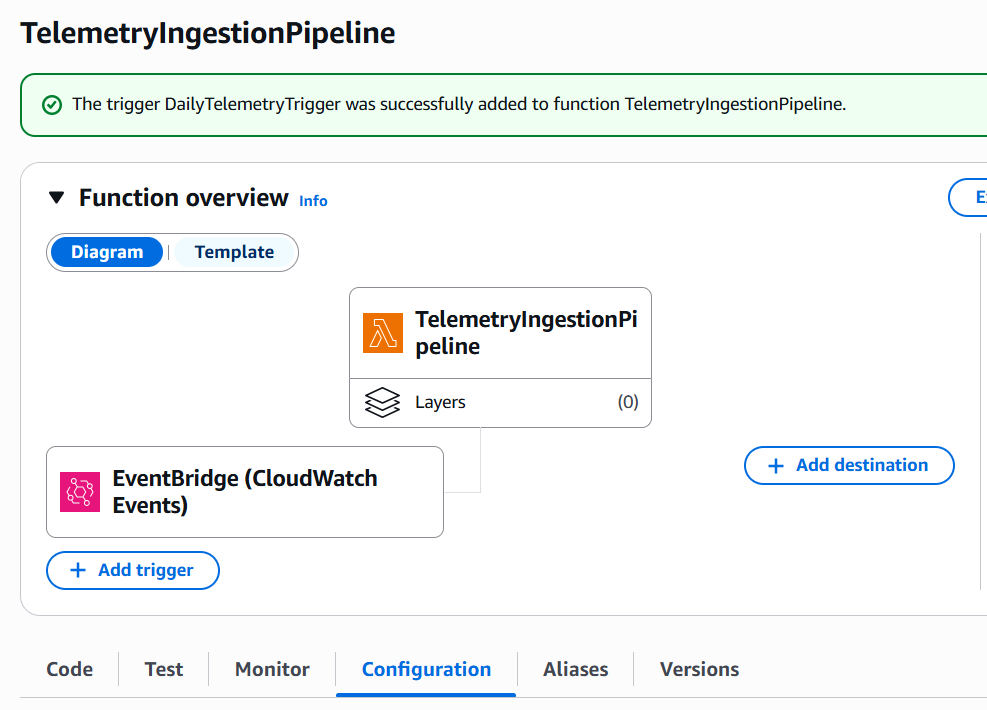
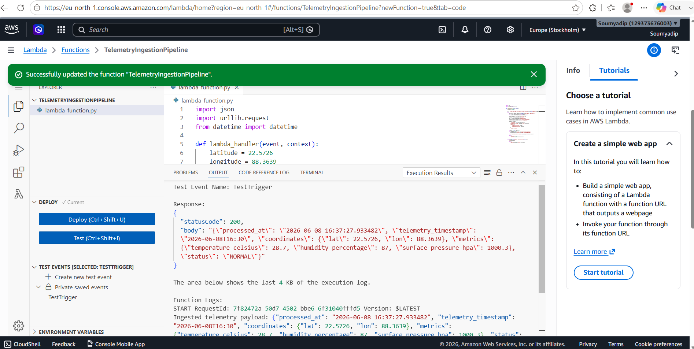
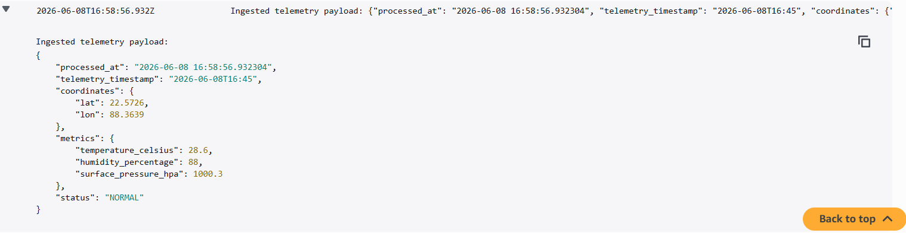
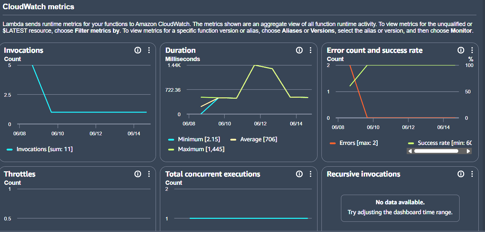

# Serverless-telemetry-pipeline (Browser based)
I wanted to make a serverless telemetry pipeline using web services, So i built this entire automated data pipeline directly inside the web browser using AWS and Github's web interface.
So what it does actually is automatically wakes uo everyday and pulls live satellite/enviromental data from open API, checks for weather anomalies and dumps the log into CloudWatch. Zero Servers to manage, zero local code to compile.

## Workflow
1. **Amazon EventBridge** acts as a timer, triggering the project automatically once every 24 hours.
2. **AWS Lambda** spins up a tiny, temp Python backend to execute the script.
3. **The Script** fetches live env data (temp, humidity, pressure) for a target location.
4. If the temp is very high or humidity is very wild, it automatically flags it as an anomally.
5. Everything is instantly printed directly into **Amazon CloudWatch Logs**.

* **No 'pip install':** I used python's built in 'urllib.request' and 'json' libs instead of 'requests' so that i dont have to deal with installing external packages or datas to AWS.

## SS 
1. SETUP 
2. LIVE RUN 
3. LOGS 

## Production Metrics

CloudWatch metrics confirm stable execution across all serverless dimensions.

.png)

* **Invocations & Concurrency:** One automated invocation per day. Peak concurrency stabilized at 1 with zero throttling.
* **Latency & Queue Age:** Execution duration averaged 706ms despite a temporary upstream API spike on June 12. Async event age remained flat, averaging 34.86ms.
* **Errors & Delivery Rates:** Maintained a 100% success rate with zero dropped events or delivery failures post-remediation.
